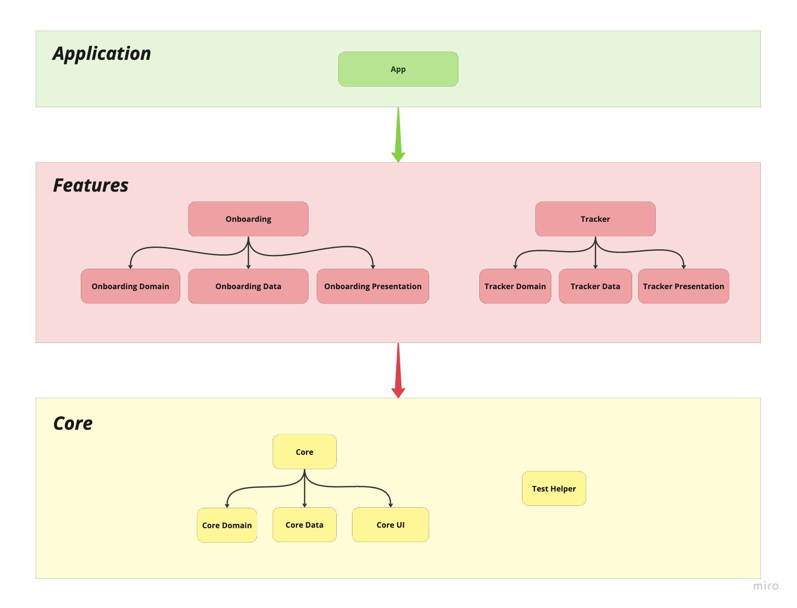

# Money Tracker
Este projeto é destinado à estudos de novas tecnologias e ferramentas envolvendo desenvolvimento Android.

A ideia é implementar uma simples ferramenta de controle de gastos, porém em um ambiente controlado onde é possível testar tecnologias mais novas, diferentes design patterns e abordagens de como resolver problemas cotidianos.

## 🛠️ Ferramentas utilizadas
- Criação da UI utilizando [Jetpack Compose](https://developer.android.com/jetpack/compose)
- Persistência local com [Room](https://developer.android.com/training/data-storage/room)
- Injeção de dependência com [Hilt](https://developer.android.com/training/dependency-injection/hilt-android)
- Operações assíncronas utilizando [Kotlin Coroutines](https://kotlinlang.org/api/kotlinx.coroutines)
- Networking com [Retrofit](https://square.github.io/retrofit) e [OkHttp](https://square.github.io/okhttp)

## 🧪 Testes
- Framework para testes utilizado: [JUnit5](https://github.com/mannodermaus/android-junit5)
- Biblioteca para criação de mocks: [MockK](https://mockk.io)
- Ferramenta para testes de Kotlin Coroutines Flow: [Turbine](https://github.com/cashapp/turbine)

## 📱 Features
As atuais funcionalidades do aplicativo são:
- Permitir o usuário selecionar a partir de um processo de onboarding as categorias que deseja utilizar para lançar gastos;
- Criar registros de despesas ou receitas, onde a informação é persistida localmente e sincronizada com um servidor (atualmente este serviço está sendo mockado);
- Alternar entre dark e light mode.

## 🏠 Arquitetura
Foi utilizado [Clean Architecture](https://blog.cleancoder.com/uncle-bob/2012/08/13/the-clean-architecture.html) para o desenvolvimento deste projeto, a fim de que as camadas estejam bem desacopladas; permitindo uma melhor escalabilidade e realização de testes.

O app foi separado em módulos respeitando as camadas da arquitetura utilizada, além de permitir um melhor build time conforme o projeto cresce.

Este desenho ilustra melhor a atual estrutura utilizada:

- ***app***: Concentra todos os gráficos de navegação entre features;
- ***onboarding***: Contém os arquivos referentes ao fluxo de onboarding do usuário;
- ***tracker***: Contém todo o fluxo de registro de despesa/receita do app;
- ***core***: Possui todo código que pode ser compartilhado entre os módulos, desde regras de negócio e utilitários até componentes de UI e o próprio tema do aplicativo;
- ***test_helper***: Classes utilitárias para auxiliar na execução de testes.
